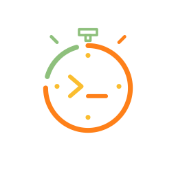

# oledoro

**Minimalist, battery-saving Pomodoro timer for OLED displays — now on Android and Desktop (Linux/Windows/macOS).**

<p align="center">
  
</p>

<p align="center">
  <a href="#features">Features</a> •
  <a href="#download">Download</a> •
  <a href="#building">Building</a> •
  <a href="#configuration">Configuration</a> •
  <a href="#architecture">Architecture</a>
</p>

---

## Features

### Core Pomodoro
- **Focus / Short Break / Long Break** cycles (customizable durations)
- **Overtime tracking** — continues counting negative time after session ends
- **Automatic phase progression** — Focus × N → Long Break → repeat
- **Session persistence** — settings survive app restarts

### Visual Design
- **Gruvbox color palette** — easy on OLED, true blacks
- **JetBrains Mono** — crisp monospace timer digits
- **Phase-aware colors**:
  - Focus: Main accent (default Yellow)
  - Break: Break color (default Aqua)
  - Overtime: Negative color (default Red)
- **Burn-in prevention** — subtle pixel shift on Android

### Desktop (Linux/Windows/macOS)
- **Native notifications** via `notify-send` / Windows Toast / macOS UserNotifications
- **App icon** in notifications (transparent outline, Gruvbox strokes)
- **Settings dialog** with color pickers + time sliders
- **Always-visible controls** (Start/Pause/Skip/Reset)
- **Total time counters** at bottom (horizontal layout)

### Android
- **Ambient/Always-on display** support
- **Auto-dim/brighten** on session start/end (configurable)
- **Foreground service** with persistent notification
- **Total time counters** (vertical stack)
- **Adaptive icon** (mechanical timer design)

### Shared
- **Reactive settings** — color/time changes apply instantly
- **File-based persistence** (`~/.oledoro/desktop.properties`)
- **Comprehensive test suite** (66 unit tests)

---

## Download

### Android
| Method | Link |
|--------|------|
| **Debug APK** | `app/build/outputs/apk/debug/app-debug.apk` (after build) |
| **Install via adb** | `adb install app/build/outputs/apk/debug/app-debug.apk` |

> **Requires**: Android 8.0+ (API 26), notification permission for foreground service

### Desktop (Linux/Windows/macOS)
```bash
# Run directly
./gradlew :desktop:run

# Package distributable (creates installer/package)
./gradlew :desktop:package
```

| Platform | Output |
|----------|--------|
| Linux | `desktop/build/compose/binaries/main/app/` (AppImage, .deb, .rpm, .tar.gz) |
| Windows | `desktop/build/compose/binaries/main/app/` (.msi, .exe) |
| macOS | `desktop/build/compose/binaries/main/app/` (.dmg, .pkg) |

> **Requires**: Java 17+ (bundled in package), Wayland/X11 (Linux)

---

## Building

### Prerequisites
- **JDK 17+** (tested with 17, 21)
- **Android SDK** (for `app` module) — API 34, build-tools 34
- **Gradle** (wrapper included)

### Commands
```bash
# Clone
git clone https://github.com/yourusername/oledoro.git
cd oledoro

# Build all modules
./gradlew build

# Android only
./gradlew :app:assembleDebug

# Desktop only (run)
./gradlew :desktop:run

# Desktop only (package)
./gradlew :desktop:package

# Run all tests
./gradlew test
```

### Module Structure
```
oledoro/
├── app/                 # Android application
│   └── src/main/...     # Activities, Services, Android-specific UI
├── common/              # Shared Kotlin (domain, data, UI, theme)
│   ├── src/main/...     # TimerEngine, TimerState, Settings, Theme, Components
│   └── src/test/...     # Unit tests (32 tests)
├── desktop/             # Compose Desktop (JVM)
│   ├── src/main/...     # Main.kt, SettingsDialog, Notifications
│   └── src/test/...     # Unit tests (5 tests)
├── settings.gradle.kts
├── build.gradle.kts
├── CHANGELOG.md
└── README.md
```

---

## Configuration

All settings are persisted to `~/.oledoro/desktop.properties` (both platforms).

### Timer Durations
| Setting | Range | Default |
|---------|-------|---------|
| Focus Time | 1–90 min | 25 |
| Short Break | 1–30 min | 5 |
| Long Break | 1–60 min | 15 |
| Long Break Interval | 1–10 rounds | 4 |

### Colors (Gruvbox Palette)
| Role | Default | Options |
|------|---------|---------|
| Main Accent | Yellow (`#FABD2F`) | All 7 Gruvbox colors |
| Break Timer | Aqua (`#8EC07C`) | All 7 Gruvbox colors |
| Overtime/Negative | Red (`#FB4934`) | All 7 Gruvbox colors |

**Gruvbox Colors**: Yellow, Orange, Green, Aqua, Blue, Red, Cream

### Android Only
| Setting | Default |
|---------|---------|
| Auto-dim on start | On |
| Auto-brighten on finish | On |
| Dim level | 5% |

---

## Architecture

### Domain Layer (`common/src/main/kotlin/com/lolerco/oledoro/domain/`)
- **TimerEngine** — Core logic: tick, phase transitions, overtime, duration updates
- **TimerState** — Immutable data: phase, status, durations, totals, progress
- **TimerPhase** — FOCUS, SHORT_BREAK, LONG_BREAK, OVERTIME, IDLE
- **TimerStatus** — IDLE, RUNNING, PAUSED, OVERTIME
- **TimeFormatter** — `M:SS` formatting, progress calculation

### Data Layer (`common/src/main/kotlin/com/lolerco/oledoro/data/`)
- **AppSettingsManager** — Reactive settings with file persistence
- **GruvboxColor** — Enum with Compose `Color` conversion

### UI Layer (`common/src/main/kotlin/com/lolerco/oledoro/ui/`)
- **Theme** — Gruvbox colors, JetBrains Mono typography
- **Components** — TimerDisplay, ControlsRow, SettingsDialog, NextPhasePreview, RoundIndicator
- **Utils** — HapticHelper (no-op on Desktop)

### Platform-Specific
| Module | Entry Point | Key Classes |
|--------|-------------|-------------|
| `app` (Android) | `MainActivity` + `MainViewModel` | `AmbientScreen`, `TimerForegroundService`, `NotificationHelper` |
| `desktop` | `Main.kt` | `DesktopApp`, `DesktopSettingsDialog`, `DesktopNotificationManager` |

### Testing
```
./gradlew test
```
- **common**: 32 tests (TimerEngine 14, TimerState 17, AppSettingsManager 11, TimeFormatter 8, AutoBrightenAndCycle 19)
- **desktop**: 5 tests (DesktopNotificationManager)
- **app**: Existing Android unit tests

All tests run on every commit via CI.

---

## License

MIT License — see [LICENSE](LICENSE) for details.

---

## Credits

- **Created by**: lolerco
- **Font**: [JetBrains Mono](https://github.com/JetBrains/JetBrainsMono)
- **Palette**: [Gruvbox](https://github.com/morhetz/gruvbox)
- **Framework**: [Compose Multiplatform](https://github.com/JetBrains/compose-multiplatform)